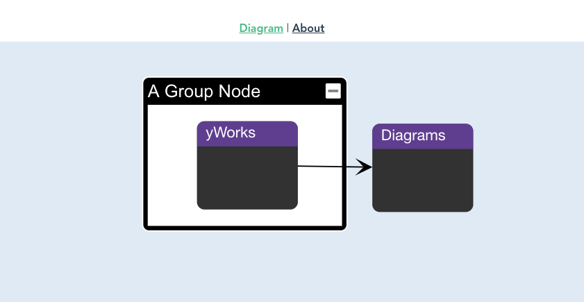

# yFiles Vue TypeScript Starter

This is a basic project showing how to use yFiles with Vue and TypeScript. Some custom styling is included as well as code for layout. With this in place you should be able to venture into more interesting graph visualizations, see the [yFiles demo page](https://live.yworks.com/demos/) for inspiration. 

## Setup

- You need a license to run this project, see [the yWorks website](https://my.yworks.com) for a trial. Insert this license in the `assets/license.json` file.
- Make sure the path to the yFiles `yfiles-*.tgz` file is set in `package.json`.
- Install things as usual with `npm i`.
- Run it with `npm start`.

## Info and Support

Info and support [@TheOrbifold](https://twitter.com/theorbifold). 
